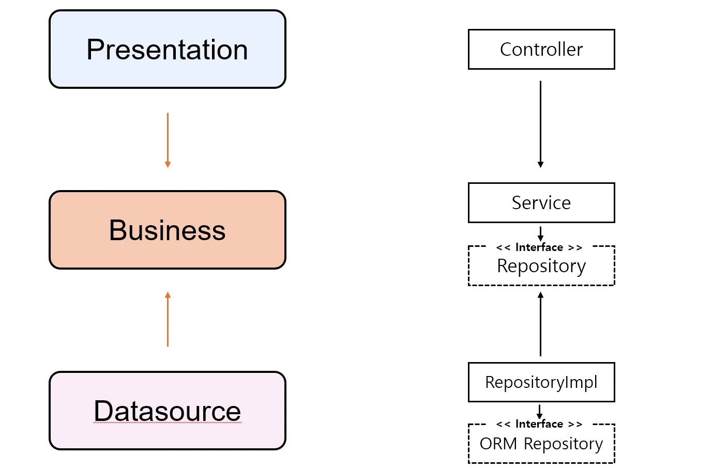
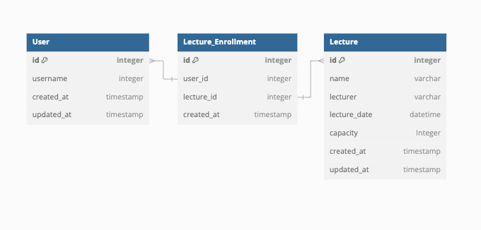

# [2주차] 특강 신청 서비스 

## 1. 아키텍처 (클린-레이어드 아키텍처)

- 애플리케이션의 핵심은 비즈니스 로직
- 데이터 계층 및 API 계층이 비즈니스 로직을 의존 ( 비즈니스의 Interface 활용 )
- 도메인 중심적인 계층 아키텍처
- Presentation 은 도메인을 API로 서빙, DataSource 는 도메인이 필요로 하는 기능을 서빙
- DIP 🆗 OCP 🆗

```
 /interfaces
  /api
   /lecture
    - LectureController
   /user
    - UserController
  /dto
   /lecture
    - LectureRequest
    - LectureResponse
   /user
    - UserRequest
    - UserResponse
 /application
 /domain
  /lecture
    - Lecture
    - LectureEnrollment
    - LectureEnrollmentRepository
    - LecutreRepository
    - LectureService
  /user
    - User
    - UserReposiotry
    - UserService
 /infrastructure
  /lecture
    - LectureEnrollmentJpaRepository
    - LectureEnrollmentRepository
    - LectureJpaRepository
    - LectureRepositoryImpl
  /user
    - UserJpaRepository
    - UserRepositoryImpl
```

## 2. 요구사항
1️⃣ **특강 신청 API** (**POST** /api/v1/lectures/{lecture_id})   
[x] 특정 userId 로 선착순으로 제공되는 특강을 신청하는 API 를 작성합니다.  
[x] 동일한 신청자는 동일한 강의에 대해서 한 번의 수강 신청만 성공할 수 있습니다.  
[x] 특강은 선착순 30명만 신청 가능합니다.  
[x] 이미 신청자가 30명이 초과 되면 이후 신청자는 요청을 실패합니다.  

2️⃣ **특강 신청 가능 목록 API** (**GET** /api/v1/lectures?startDate=?&endDate=?)  
[x] 날짜별로 현재 신청 가능한 특강 목록을 조회하는 API 를 작성합니다.  
[x] 특강의 정원은 30명으로 고정이며, 사용자는 각 특강에 신청하기 전 목록을 조회해 볼 수 있어야 합니다.

3️⃣ **특강 신청 완료 목록 조회 API** (**GET** /api/v1/lectures/{user_id})  
[x] 특정 userId 로 신청 완료된 특강 목록을 조회하는 API 를 작성합니다.   
[x] 각 항목은 특강 ID 및 이름, 강연자 정보를 담고 있어야 합니다.  

## 3. ERD (Entity Relationship Diagram)

- Lecture ↔ Registration: 1 : N 관계
    - 하나의 강의(Lecture)에 여러 Registration(신청) 레코드가 생길 수 있음.
- User ↔ Registration: 1 : N 관계
    - 하나의 사용자(User)가 여러 Registration(신청) 레코드가 생길 수 있음.
- Registration 테이블은 Lecture와 User의 중간 테이블 역할을 수행.

### 3-1. 테이블 상세
#### User (사용자)
- **컬럼**
    - `id (PK)`: 사용자 ID, Long, Auto Increment
    - `username`: 사용자 이름, Varchar(255)
    - `created_at`: 생성일시, Timestamp
    - `updated_at`: 수정일시, Timestamp

#### Lecture (강의)
- **테이블명** : `lecture`
- **컬럼**
  - `id (PK)`: 강의 ID, Long, Auto Increment
  - `name`: 강의명, Varchar(255)
  - `lecturer`: 강연자명, Varchar(255)
  - `lecture_date`: 강의 일시, DateTime
  - `capacity`: 정원, Integer
  - `remain_seats`: 여석, Integer
  - `created_at`: 생성일시, Timestamp
  - `updated_at`: 수정일시, Timestamp

#### Lecture_Enrollment (강의신청)
- **컬럼**
  - `id (PK)`: 신청 내역 ID, Long, Auto Increment
  - `user_id (FK)`: 사용자 ID (User.id)
  - `lecture_id (FK)`: 강의 ID (Lecture.id)
  - `created_at`: 신청일시, Timestamp 

- **제약 조건**  
  - `UNIQUE(user_id, lecture_id)`: 한 사용자가 같은 강의를 중복 신청할 수 없도록 설정
  - `FOREIGN KEY (user_id) REFERENCES user(id)`
  - `FOREIGN KEY (lecture_id) REFERENCES lecture(id)`

### 3.2 테이블 설계 의도
**1. `Many-to-Many` 관계 해소**
- 하나의 강의를 여러 사용자가 신청할 수 있고, 하나의 사용자가 여러 강의를 신청할 수 있음.
- `Lecture` 와 `User` 두 테이블만으로 다대다 관계를 직접 표현하기 어렵기 때문에, 
중간 테이블인 `Registration` 테이블을 두어 `1:N` / `N:1`관계로 분해하는 형태  

**2. 중복 신청 방지 및 선착순 제한**
- `Registration` 테이블에 `UNIQUE (user_id, lecture_id)` 제약을 걸어 `“한 사용자 + 한 강의”` 조합이 유일하도록 함.
- `Lecture` 테이블에 `capacity` 컬럼을 두고, `Registration`에서 해당 `lecture_id`로 
이미 등록된 인원 수`(COUNT(*))`가 `capacity`보다 작은지 체크하여 선착순 로직을 구현

**4. 유연한 확장성**  
- 요구사항 확장에 유리하며, 엔티티의 책임이 명확함.  
- 중간 테이블을 따로 두었기 때문에 추후 확장 관계도 처리가 용이

---
## 4. 참고
### **`이것부터 시작하세요!`**
- 아키텍처 준수를 위한 애플리케이션 패키지 설계
- 특강 도메인 테이블 설계 (ERD) 및 목록/신청 등 기본 기능 구현
- 각 기능에 대한 **단위 테스트** 작성

### **`STEP 3`**
- 설계한 테이블에 대한 **ERD** 및 이유를 설명하는 **README** 작성
- 선착순 30명 이후의 신청자의 경우 실패하도록 개선
- 동시에 동일한 특강에 대해 40명이 신청했을 때, 30명만 성공하는 것을 검증하는 **통합 테스트** 작성

### **`STEP 4`**
- 같은 사용자가 동일한 특강에 대해 신청 성공하지 못하도록 개선
- 동일한 유저 정보로 같은 특강을 5번 신청했을 때, 1번만 성공하는 것을 검증하는 **통합 테스트** 작성


